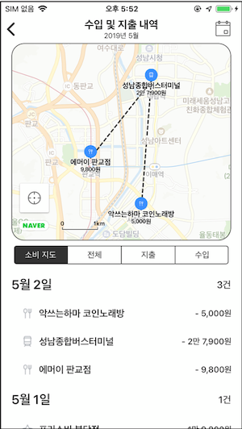
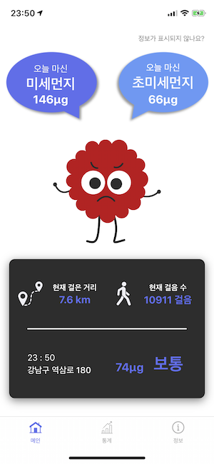
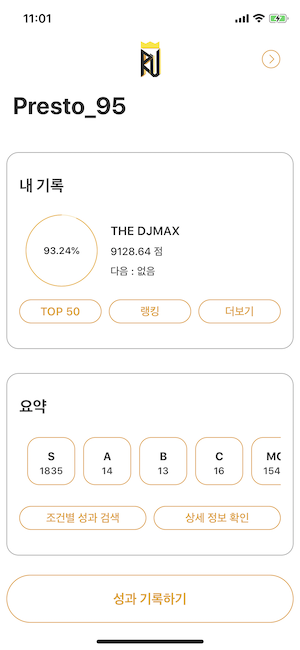
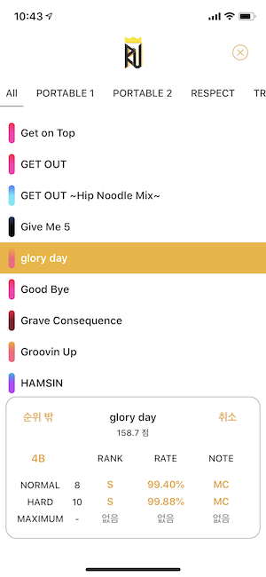
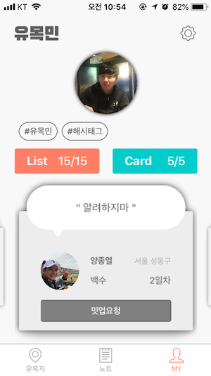
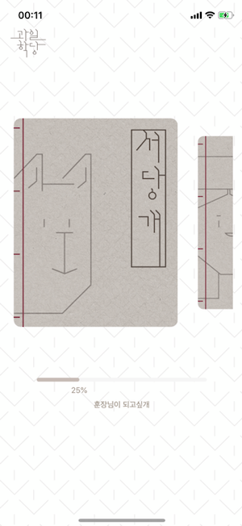
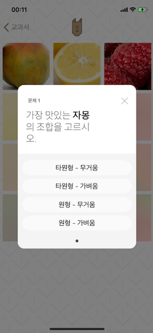

# 이력서

## 신상

### 이름 

이한결 (Lee Hangyeol)

### 생년월일

1995.9.6.

### 이메일

yoohan95@gmail.com

### 병역

필

- 공군 병장 만기제대
- 2015.1. ~ 2017.1.

## 학력

### 서울과학기술대학교

- 글로벌융합산업공학과 - 산업정보시스템전공
  - 본전공
  - 2014.3. ~
- 컴퓨터공학과
  - 복수전공
  - 2017.9 ~
- 3.89 / 4.5
- 2020.2. 졸업 예정

### 고려고등학교

- 이공계
- 2011.3. ~ 2014.2.

## 경력

### LINE Financial Plus

- F App Dev (인턴)
- 2019.4.1. ~ 2019.5.31.

## 활동

### Boostcamp 3기

- 커넥트재단
- iOS 과정
- 2019.1. ~ 2019.2.

### Boostcourse 에이스 1기

- 커넥트재단 edwith
- iOS Developer
- 2018.5. ~ 2018.9.

### NEXTERS

- IT 연합동아리
- 14기 iOS 개발
  - 2018.12. ~ 2019.2.

### YAPP

- 대학생 IT 연합동아리
- 13기 회장 / iOS 개발
  - 2018.7. ~ 2018.12.
- 12기 iOS 개발
  - 2018.1. ~ 2018.6.

## 프로젝트

### AUFFETT

- LINE Financial Plus 인턴십 과제
  - 2019.4.1. ~ 2019.5.31.
- 위치 기반 가계부 애플리케이션
- iOS / Swift / ReactiveSwift / Alamofire / Carthage / NAVER Map SDK

 

### 다연결

- 개인 프로젝트
  - 2018.12. ~
- 전국 대학교 공지사항을 모아 보여주는 애플리케이션
- iOS / Swift / ReactorKit / RxSwift / SnapKit / XLPagerTabStrip / Kanna
- [GitHub](https://github.com/presto95/UniTice)
- [App Store](https://nexters.me/Ke)

### 다연결

- 개인 프로젝트
  - 2019.6.
- 전국 대학교 공지사항을 모아 보여주는 애플리케이션
- Flutter / Dart
- [GitHub](https://github.com/presto95/UniTice_Flutter)

### 내안의먼지

- Boostcamp 3기 프로젝트
  - 2019.1. ~ 2019.2.
  - 참여도 上 (통계 화면 / Network, Core Locaiton 등 다양한 기능 모듈화)
- 이동 거리에 따라 미세먼지 흡입량을 계산하여 알려주는 애플리케이션
- iOS / Swift / HealthKit / URLSession
- [GitHub](https://github.com/boostcamp3-iOS/team-c2)

 

### RespectU

- 개인 프로젝트
  - 2017.10. ~ 2019.3.
- 게임 DJMAX RESPECT의 가이드 애플리케이션
- iOS / Swift / Realm / XLPagerTabStrip
- [GitHub](https://github.com/presto95/RespectU)

 

### 유목민

- YAPP 12기 프로젝트
  - 2018.1. ~ 2018.6.
  - 참여도 上 (iOS 클라이언트 전체)
- 디지털 노마드를 위한 일정 관리 및 연결 서비스를 제공하는 애플리케이션
- iOS / Swift / Firebase / Realm / Alamofire / SnapKit / FSPagerView / Daum Map SDK
- [GitHub](https://github.com/presto95/DigitalNomad)

 

### 과일학당

- YAPP 13기 프로젝트
  - 2018.7. ~ 2018.12.
  - 참여도 上 (iOS 클라이언트 전체)
- 과일에 대한 상식을 다양한 퀴즈를 통해 배울 수 있는 애플리케이션
- iOS / Realm / Kingfisher / SnapKit / FSPagerView
- [GitHub](https://github.com/presto95/FruitSchool)

 