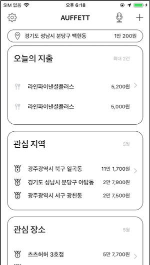
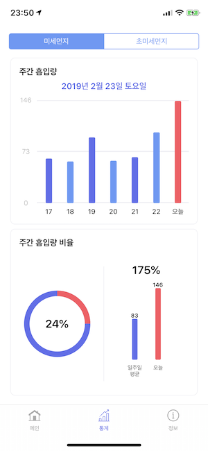
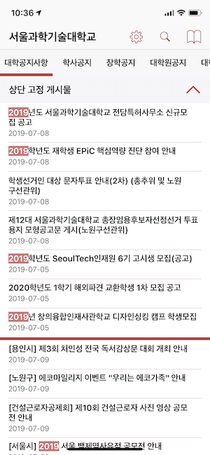
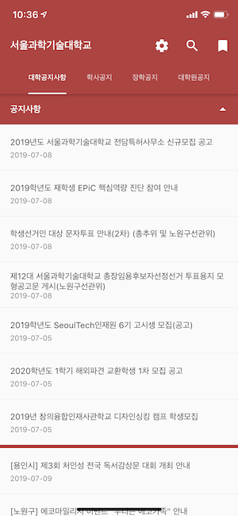

# 안녕하세요, 이한결입니다.

iOS 앱 개발자로 소프트웨어 개발자 커리어를 시작한 지 2년이 되어 가고 있습니다. 결국 사람이 보기에 좋은 코드를 작성하는 것이 개인과 팀의 생산성을 끌어올려준다고 믿습니다. 재택 근무를 하고 있지만, 팀원들과 공간적으로 함께 어울리며 일하는 분위기를 좋아합니다. 주요한 업무 외에도 개선할 점을 찾아 고치는 것을 즐깁니다. 이동 중에 틈틈히 개발 서적을 읽는 것을 좋아합니다. 모호한 표현보다는 최대한 단언하는 표현을 사용하여 커뮤니케이션하려고 노력합니다.

---

# Work Experience

## Coupang

iOS Engineer | 2020.2. ~ 현재

### RDS

Rocket Design System의 줄임말로, 쿠팡의 디자인 시스템을 구축하는 프로젝트에 참여했습니다. iOS 엔지니어로서 iOS 환경에서 사용할 수 있는 UI 라이브러리를 만들고 유지보수하며, 쿠팡 iOS 애플리케이션에 적용했습니다.

**Contribution**

- 다양한 UI 컴포넌트 개발, 테스트 및 유지보수
- 쿠팡 iOS 애플리케이션에 점진적으로 적용
- RDS 샘플 앱 개발에 특화된 선언형 UI 프레임워크 개발
- RDS를 사용하는 사내 개발자와의 커뮤니케이션 및 지원

**Tech Stack**

Swift, iOS, SnapKit, LayoutKit, LayoutDrivenUI, iOSSnapshotTestCase(FBSnapshotTestCase)

### Full Stack Project

기존 피쳐의 전환율 및 GMV의 상승을 위해 노력합니다. Product Owner 및 Product Designer, 그리고 Backend Engineer와의 활발한 커뮤니케이션을 통해 스펙을 논의하고 가장 효율적인 구현 방안을 모색합니다. AB 테스트를 적용하여 다양한 케이스를 실험하고, 여러 번의 이터레이션을 통해 고객이 가장 좋아한다는 것이 데이터로 입증된 피쳐를 릴리즈합니다. 저는 iOS 엔지니어로서 쿠팡 iOS 애플리케이션에 해당 작업을 진행했습니다.

**Contribution**

- 배송 피드백 팝업 리뉴얼

**Tech Stack**

Swift, iOS, SnapKit

## LINE Financial Plus

iOS Developer (인턴) | 2019.4. ~ 2019.5.

### 위치 기반 가계부 애플리케이션

LINE 가계부의 API를 사용하는 가계부 애플리케이션을 개발하는 과제를 받았고, 특화 기능으로 위치의 개념을 가계부에 접목한 위치 기반 가계부 애플리케이션을 개발하였습니다.

**Contribution**

- 지출 위치를 기록하여 '소비 지도'를 볼 수 있는 기능 개발
- 수입 및 지출을 기록하는 가계부 기능 개발
- SDK를 래핑하여 Swift스러운 코드로 필요한 기능만 사용할 수 있도록 함
- ViewModel에 대한 Unit Test를 작성하여 리팩토링에 도움을 줌
- 일부 기능 개발에 TDD를 도입하여 개발
- Memory Profiling을 통해 메모리 누수 문제 해결
- [인턴십 최종 발표 자료](https://drive.google.com/file/d/1MT_1ZfaFOok22LpZJZBcb79OgFLopiqO/view?usp=sharing)

**Tech Stack**

Swift, iOS, ReactiveSwift, Alamofire, Carthage, NAVER Map SDK

# Other Experience

## 공개SW 컨트리뷰톤

2019.9. ~ 2019.10.

### 구름입력기

정보통신산업진흥원에서 주관하는 2019년 공개SW 컨트리뷰톤에서 '[구름 입력기](https://github.com/gureum/gureum)' 오픈소스 프로젝트에 참여하였습니다. 성과를 인정받아 우수상을 수상하였고, 개인적으로는 팀 내 최다 기여를 인정받아 MVP를 수상하였습니다.

**Contribution**

- Objective-C에서 Swift로 포팅된 코드를 Swift스럽게 리팩토링
- 사용성 개선
- 개발자 문서 보강
- [커밋 내역](https://github.com/gureum/gureum/commits?author=presto95)

**Tech Stack**

Swift, macOS

## Boostcamp

3기 iOS 과정 | 2019.1. ~ 2019.2. 

### 내안의먼지

네이버 커넥트재단에서 주관하는 Boostcamp에서 3기 iOS 과정에 참여하여, 내가 마신 미세먼지의 양을 알려주는 [내안의먼지](https://github.com/boostcamp3-iOS/team-c2) 프로젝트를 진행하였습니다. 실무자 멘토링을 통해 짧은 시간 동안 많이 배울 수 있는 시간이었습니다.

**Contribution**

- 팀 리드
- Coding Convention 수립 및 네트워킹 등 기반 코드 작성
- 내가 마신 미세먼지의 양에 대한 다양한 통계 정보를 여러 그래프의 형태로 나타내는 화면 개발
- CI 및 Codecov 등의 툴 도입

**Tech Stack**

Swift, iOS, HealthKit, Core Location, Core Data, SwiftLint, SwiftGen, xUnique, Instruments, Today Extension, XCTest, Travis CI

## Sharing

### Collection View

2020.1.18.

iOS의 UICollectionView 및 이와 관련 있는 것들을 공부하고 커뮤니티에서 발표하였습니다. 이를 통해 컬렉션 뷰를 잘 이해하고, 나아가 새롭게 추가된 API에 대해서도 이해할 수 있었습니다.

**Contribution**

- [발표 자료](https://www.slideshare.net/HanGyeolLee4/collection-view-220540914)

**Tech Stack**

iOS

### Swift 성능 이해하기

2019.12.21.

2016년 Let'Swift의 '스위프트 성능 이해하기' 세션을 공부하고 정리하여 커뮤니티에서 발표하였습니다. 이를 통해 Swift의 여러 타입이 내부적으로 동작하는 모습을 실제로 확인할 수 있는 등, Swift에 대해 더욱 깊게 알게 되었습니다. 동일한 내용을 사내에서도 공유하여 함께 이야기하기도 했습니다.

**Contribution**

- [발표 자료](https://www.slideshare.net/HanGyeolLee4/swift-220176323)

**Tech Stack**

Swift

## Personal Project

### BoxOffice_SwiftUI

2019.11 / 2020.6.

부스트코스 마지막 프로젝트의 요구사항을 SwiftUI와 Combine을 사용해서 구현하였습니다. SwiftUI와 Combine을 실제 프로젝트에 적용해보는 좋은 기회가 되었습니다. 사내에서 이 코드를 바탕으로 SwiftUI와 Combine을 소개하는 시간을 갖기도 했습니다.

**Contribution**

- 네트워킹을 통해 영화 정보를 애플리케이션에 나타냄
- SwiftUI와 Combine을 최대한 활용
- [코드](https://github.com/presto95/BoxOffice_SwiftUI)

**Tech Stack**

Swift, SwiftUI, Combine

### Combine 🤝 RxSwift 🤝 ReactiveSwift

2019.10. ~ 2019.11.

Combine의 구성 요소를 RxSwift 및 ReactiveSwift와 비교하여, RxSwift 등에 익숙한 개발자가 Combine을 빠르게 학습할 수 있도록 정리하였습니다. 이 문서를 작성하면서 개인적으로도 Combine에 더욱 빠르게 익숙해질 수 있는 계기가 되었습니다.

**Contribution**

- [GitHub Repository](https://github.com/presto95/Combine-RxSwift-ReactiveSwift)
- [GitBook](https://presto95.gitbook.io/combine-rxswift-reactiveswift/)

**Tech Stack**

Combine, RxSwift, ReactiveSwift

### 다연결

2018.12. ~ 2019.2.

전국 대학교의 공지사항을 한 곳에 모아 보여주기 위한 취지로 개발했습니다. ReactorKit을 사용하여 RxSwift에 빠르게 익숙해지고자 하였습니다. Flutter 학습의 취지로 iOS 네이티브로 작성된 코드를 Flutter로 다시 개발하기도 했습니다.

**Contribution**

- 각 대학교 웹사이트의 HTML 페이지를 파싱하는 공통 로직 개발
- 키워드 하이라이팅 기능 개발
- [코드](https://github.com/presto95/UniTice)

**Tech Stack**

Swift, iOS, ReactorKit, RxSwift, SnapKit, XLPagerTabStrip, Kanna, Dart, Flutter

 

# Skill

## Communication

- 단언할 수 있는 상황이라면, 모호한 표현을 피하고 단언하는 표현을 사용합니다.
- 팀원의 경력이나 성향에 관계 없이 생각하는 바를 명확하게 표현합니다.
- 숨어 있지 않고 투명하게 커뮤니케이션하기 위해 노력합니다.

## Swift

- Swift Style Guidelines를 준수합니다.
- Generics, Protocol Oriented Programming 등을 이해하고 있습니다.
- ARC를 이해하고, Reference Cycle을 피하는 코드를 작성할 수 있습니다.
- Swift가 내부적으로 어떻게 동작하는지 이해하고 있고, Memory Debugger 및 Swift Intermediate Language를 통해 직접 확인해 보았습니다.

## iOS

- UIKit을 사용하여 다양한 커스텀 뷰를 개발할 수 있습니다.
- SnapKit, FSPagerView 등 UI 개발에 도움을 주는 다양한 라이브러리를 사용한 경험이 있으며, 기반 기술도 이해하고 있습니다.
- Alamofire, Moya 등 HTTP 네트워킹에 도움을 주는 다양한 라이브러리를 사용한 경험이 있으며, 기반 기술도 이해하고 있습니다.
- MVC, MVVM, ReactorKit 등의 아키텍쳐 패턴을 이해하고, 사용한 경험이 있습니다.
- Reactive Programming을 이해하고, RxSwift나 ReactiveSwift와 같은 라이브러리를 사용한 경험이 있습니다. 
- SwiftUI, Combine 등을 적용하여 애플리케이션을 개발한 경험이 있습니다.

## Tool

- Xcode에 친숙하며, Instruments를 사용한 프로파일링 경험이 있습니다.
- Terminal과 Sourcetree를 사용하여 Git을 활용합니다.
- GitHub를 활용한 Pull Request 및 Code Review에 익숙합니다.
- Jira를 활용한 Bug Tracking System에 익숙합니다.

# Contact

- [Email](mailto:yoohan95@gmail.com)
- [LinkedIn](https://www.linkedin.com/in/한결-이-463750152/)
- [GitHub](https://github.com/presto95)
